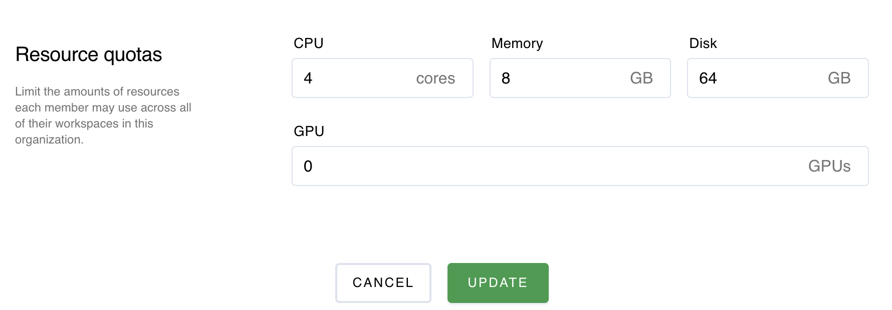
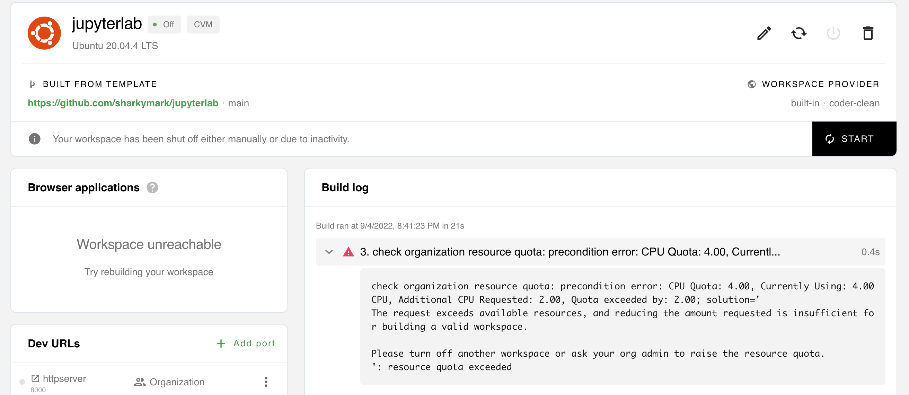
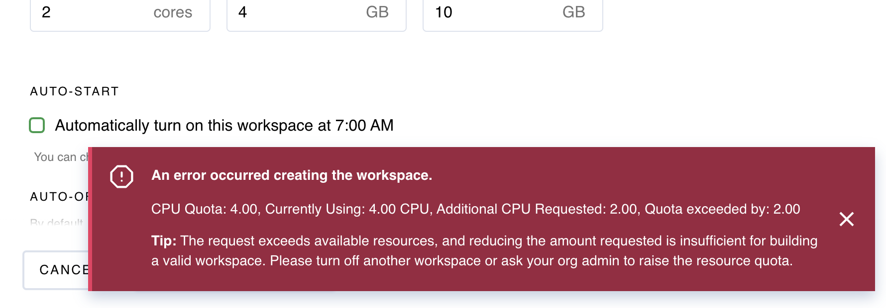

# v1 FAQ
- [Build log says not enough resources](#build-log-says-not-enough-resources)

# Build log says not enough resources
Administrators can limit the computing resources consumed with resource quotas which are defined at the Organization-level.

Here is a screenshot of the Organization/Edit UI where quotas are defined. These are the maximum compute per user and there is no limit to the number of workspaces a user can build as long as these aggregate quotas are not exceeded.

Here is a screenshot of the build log error when a user exceeds their quota.

Here is a screenshot from the Create Workspace UI if a quota is exceeded.

## Resources
